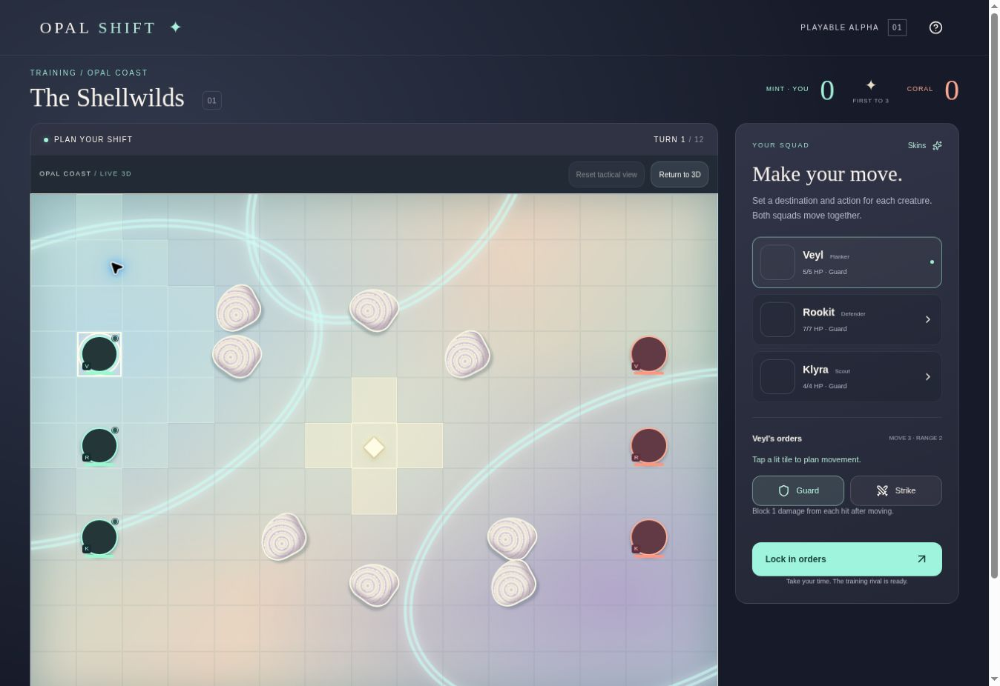

# Opal Coast 3D vertical slice — draft handoff

## Status

Implemented on `astra/3d-vertical-slice` from GitHub `main` at
`95aaba39ba35e1db99506f104b9de43d9a2aceac`. **Not ready for acceptance or merge.**
The test browser reports `GL_VENDOR = Disabled`, `GL_RENDERER = Disabled`, and
cannot create a WebGL context. No actual 3D render, raycast, camera gesture,
animation, GPU performance, or real-phone touch verification is claimed.
The retained tactical interface remains playable without WebGL.

No deployment was requested as a prerequisite to this branch review. The public
Site and `main` were not updated. There is no deployed preview of this branch.

## Baseline audit

Read README, AGILE, page, global styles, engine, room server, existing tests,
package manifest, art metadata, and hosting configuration. `AGENTS.md`,
`CLAUDE.md`, and `docs/design/opal-shift-design.md` were absent on the specified
base branch; earlier setup work exists on separate unmerged branches. Those
branches were not merged or copied into this task.

| Command | Before | After implementation |
| --- | --- | --- |
| `pnpm run build` | Exit 0 | Exit 0 |
| `pnpm exec tsc --noEmit` | Exit 0 | Exit 0 |
| `pnpm run lint` | Exit 1: 2 errors, 2 warnings | Exit 0: no errors/warnings |
| `node --experimental-strip-types --test tests/*.test.mjs` | 11 passed, 0 failed | 17 passed, 0 failed |

Baseline lint findings were browser-storage hydration, an unescaped apostrophe,
and stale-effect dependency warnings. The integrated page fixes the apostrophe
and uses effect events for polling and the read-only modelContext callback.
Two narrowly documented lint exceptions cover external browser-storage and GPU
capability hydration. No global lint rules were disabled.

The production build still emits Vinext route-classification and large-chunk
warnings. They do not fail the build. The build uses the existing bounded runner.

### Existing state flow, retained

Training owns a full engine `Game` but sends only `view(game, team)` to presentation.
Rooms already return filtered `Game` payloads. Selection identifies an owned unit;
`reachable` supplies exact destinations; the existing `tile` handler updates the
existing `Order[]`. Guard/Strike controls and server validation are unchanged.
Training resolves through `resolve(game, orders, bot(game, 1))`; private games use
the existing `/api/rooms` POST and 1600 ms polling. Version checks reject older
payloads. New rounds reset orders to defaults. Ready/busy/winner states and the
new visual-reveal state gate order entry. Results appear after the reveal.

## Architecture

- `components/game3d/Battlefield.tsx`: browser-only lazy renderer, GPU preflight,
  error boundary, context-loss fallback, reset control, and retained 2D interface.
- `OpalArena3D.tsx`: Canvas, bounded team-aware orthographic camera, raycast cell
  mapping, reachable ripples, own-order path and destination beacon, live units.
- `Environment3D.tsx`: procedural colored/elevated coast, water, distant shells,
  root tubes, vegetation, particles, fog, and conservative lighting/shadows.
- `Shell3D.tsx`: pearlescent ridged cover inside the existing obstacle footprints.
- `Creature3D.tsx`: replaceable procedural bodies for Veyl, Rookit, and Klyra;
  team marks, health, idle/move/strike/guard/hit/KO/respawn presentation.
- `Prism3D.tsx`: the same five-cell objective, control colors and scoring pulse.
- `ResolutionEffects.tsx`: post-resolution beams/guard impacts with safe endpoints.
- `arena-math.ts`: pure coordinate mapping, public-terrain display paths, filtered
  state transition derivation, and prism presentation classification.
- `game3d.css`: responsive scene/HUD, mobile order panel, keyboard focus styles.
- `app/page.tsx`: integration only; retains lobby, room dialogs, skins, help,
  scoreboard, original board, and modelContext tool.
- `tests/presentation.test.mjs`: six new pure tests, no WebGL required.

### Dependencies

Added `three` 0.185.1, `@react-three/fiber` 9.7.0, `@react-three/drei` 10.7.8,
and development types `@types/three` 0.185.4 using the configured pnpm 11.19.0.
The lockfile is committed. No external model, texture, font, paid service,
second app, iframe, or local-only file is needed by the new renderer.

## Rules, secrets, and reveal

**No changes to engine, room server, API contract, hosting configuration, artwork,
stats, movement/range, guard reduction, concealment, contested destinations,
respawn, scoring, 12-turn limit, room deadlines, or private orders.**
The five-second delay is exclusively client presentation, not a gameplay timer.
It runs after the existing deterministic resolution; reduced-motion users skip
it. Enabling the system preference during a reveal cancels the remaining delay.

The renderer never receives full training state. Enemy meshes that disappear
from the new filtered payload are omitted immediately. Newly revealed enemies
have no historical path. Beam endpoints require both units to be present in
both filtered snapshots; a public combat log alone never reconstructs a missing
enemy. Rival action poses are inferred only from resolved, public hit messages.
Own canceled routes can recoil using the player's own submitted orders.
Enemy canceled orders are intentionally not reconstructed.

Movement paths are illustrative shortest routes through public static terrain,
not authoritative sub-turn events. The engine resolves endpoints, not physical
collisions along paths. Scores and health HUD values update from the authoritative
payload immediately; the result banner waits until the reveal ends. A future
authoritative event timeline should precede richer replay cinematography.

## Verification boundaries

Automated coverage includes all 165 coordinate round trips, outside pointer
rejection, shell-safe display paths, concealment transitions, newly revealed
enemies, HP/KO/respawn derivation, own-route recoil, score changes, and safe beam
endpoints. The original 11 tests continue to cover deterministic movement,
combat, guard, score/termination, room create/join/secret lock/resume/forfeit,
expiry, optimistic concurrency, and exactly-once resolution.

Browser testing used the existing supervised development preview, never the
public Site. Verified the unavailable-WebGL message and tactical fallback,
Veyl/Klyra destination entry, all three squad selectors, Guard/Strike toggles,
resolution input lock, a complete training loss (Mint 0–Coral 3), the result
banner, and Play again restoring initial positions/health. Direct 3D selection,
actual animation quality, knockout/respawn visuals, and OS reduced-motion
behavior remain unverified. Automated tests are not represented as manual tests.

The screenshot shows the retained fallback. Blank creature portraits are a
pre-existing artwork defect, not new procedural creature models.

## Performance decisions and known defects

- Lazy-load the 3D module after browser capability detection; retain a lightweight
  non-WebGL path. DPR capped at 1.5, one 1024px shadow map, 32 particles,
  modest procedural geometries, no post-processing, no downloaded models.
- GPU objects are owned by the declarative scene; custom floor geometry and
  timers/listeners have cleanup. No measured FPS or device thermal claims.
- Some procedural meshes are repeated rather than instanced. Profile on actual
  phones before increasing detail. Three.js adds a substantial lazy chunk.
- The test browser has no working WebGL and does not expose a supported
  touch/device-emulation API. Actual desktop/mobile 3D screenshots are pending.
- Existing `public/art/coast.png`, `creatures.png`, and `skins.png` on `main` are
  each 786446 bytes and fail full PNG decoding (invalid IDAT/filter data).
  They remain byte-for-byte untouched. Restore them from verified original
  assets in a separate owner-approved repair, rather than silently replacing art.
- Existing private rooms have no turn deadline/public matchmaking; unchanged.

## Required next gate / milestone

Do not merge this draft until a WebGL-capable browser and real phone verify:
whole-arena camera framing/reset/pan/zoom, all creature/tile raycasts, target
selection, simultaneous movement/impacts/guard/KO/respawn, concealment at both
ends, full competitive room play, narrow touch targets, system reduced motion,
context loss, and frame-time/thermal budgets. Capture desktop and phone **3D**
screenshots there. Then replace the procedural body adapter with optimized
original GLB creatures and add richer animations, keeping the engine and
visibility boundary unchanged. An event-contract proposal is a separate task.
